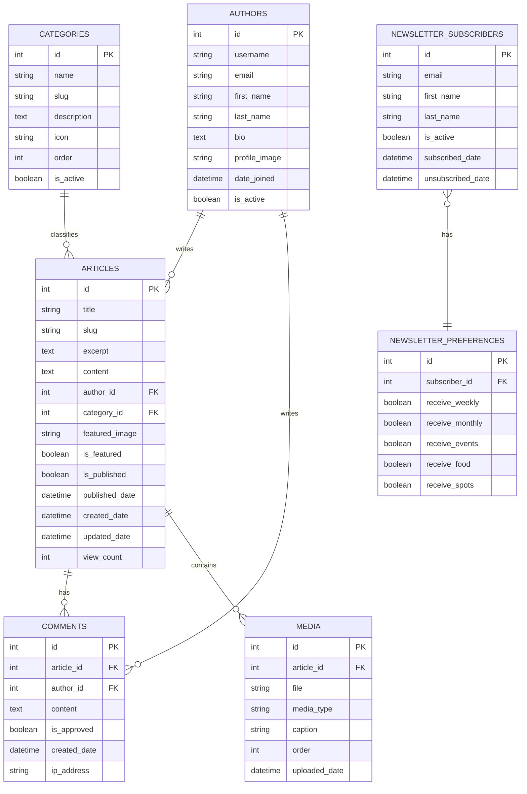

# Database Schema

## Overview
This document describes the database schema for the Kenyan Events & Lifestyle Blog website. The schema is designed to support all core features including articles, author profiles, categories, comments, and newsletter subscriptions.

## Entity Relationship Diagram

## Table Definitions

### Authors Table
Stores information about blog authors.

| Column Name | Type | Constraints | Description |
|-------------|------|-------------|-------------|
| id | Integer | Primary Key, Auto-increment | Unique identifier |
| username | String (150) | Unique, Not Null | Author's username |
| email | String (254) | Unique, Not Null | Author's email address |
| first_name | String (30) | Not Null | Author's first name |
| last_name | String (150) | Not Null | Author's last name |
| bio | Text | - | Author's biography |
| profile_image | String (200) | - | Path to profile image |
| date_joined | DateTime | Not Null | Date author joined |
| is_active | Boolean | Not Null, Default=True | Account status |

### Categories Table
Defines article categories for content organization.

| Column Name | Type | Constraints | Description |
|-------------|------|-------------|-------------|
| id | Integer | Primary Key, Auto-increment | Unique identifier |
| name | String (100) | Not Null, Unique | Category name |
| slug | String (100) | Not Null, Unique | URL-friendly category identifier |
| description | Text | - | Category description |
| icon | String (50) | - | Icon class for UI representation |
| order | Integer | Not Null, Default=0 | Display order |
| is_active | Boolean | Not Null, Default=True | Category status |

### Articles Table
Stores blog post content and metadata.

| Column Name | Type | Constraints | Description |
|-------------|------|-------------|-------------|
| id | Integer | Primary Key, Auto-increment | Unique identifier |
| title | String (200) | Not Null | Article title |
| slug | String (200) | Not Null, Unique | URL-friendly identifier |
| excerpt | Text | - | Short article summary |
| content | Text | Not Null | Full article content |
| author_id | Integer | Foreign Key (Authors.id) | Article author |
| category_id | Integer | Foreign Key (Categories.id) | Article category |
| featured_image | String (200) | - | Path to featured image |
| is_featured | Boolean | Not Null, Default=False | Featured status |
| is_published | Boolean | Not Null, Default=False | Publication status |
| published_date | DateTime | - | Date published |
| created_date | DateTime | Not Null | Date created |
| updated_date | DateTime | Not Null | Date last updated |
| view_count | Integer | Not Null, Default=0 | View counter |

### Comments Table
Stores reader comments on articles.

| Column Name | Type | Constraints | Description |
|-------------|------|-------------|-------------|
| id | Integer | Primary Key, Auto-increment | Unique identifier |
| article_id | Integer | Foreign Key (Articles.id) | Related article |
| author_id | Integer | Foreign Key (Authors.id) | Comment author |
| content | Text | Not Null | Comment content |
| is_approved | Boolean | Not Null, Default=False | Moderation status |
| created_date | DateTime | Not Null | Date created |
| ip_address | String (50) | - | IP address of commenter |

### Media Table
Stores information about media files associated with articles.

| Column Name | Type | Constraints | Description |
|-------------|------|-------------|-------------|
| id | Integer | Primary Key, Auto-increment | Unique identifier |
| article_id | Integer | Foreign Key (Articles.id) | Related article |
| file | String (200) | Not Null | Path to media file |
| media_type | String (20) | Not Null | Type (image/video) |
| caption | String (200) | - | Media caption |
| order | Integer | Not Null, Default=0 | Display order |
| uploaded_date | DateTime | Not Null | Date uploaded |

### Newsletter Subscribers Table
Stores information about newsletter subscribers.

| Column Name | Type | Constraints | Description |
|-------------|------|-------------|-------------|
| id | Integer | Primary Key, Auto-increment | Unique identifier |
| email | String (254) | Not Null, Unique | Subscriber email |
| first_name | String (30) | - | Subscriber's first name |
| last_name | String (150) | - | Subscriber's last name |
| is_active | Boolean | Not Null, Default=True | Subscription status |
| subscribed_date | DateTime | Not Null | Date subscribed |
| unsubscribed_date | DateTime | - | Date unsubscribed |

### Newsletter Preferences Table
Stores subscriber preferences for newsletter content.

| Column Name | Type | Constraints | Description |
|-------------|------|-------------|-------------|
| id | Integer | Primary Key, Auto-increment | Unique identifier |
| subscriber_id | Integer | Foreign Key (NewsletterSubscribers.id) | Related subscriber |
| receive_weekly | Boolean | Not Null, Default=True | Weekly newsletter |
| receive_monthly | Boolean | Not Null, Default=True | Monthly newsletter |
| receive_events | Boolean | Not Null, Default=True | Events content |
| receive_food | Boolean | Not Null, Default=True | Food content |
| receive_spots | Boolean | Not Null, Default=True | New spots content |

## Relationships

1. **Authors → Articles** (One-to-Many)
   - One author can write many articles
   - Each article has one author

2. **Categories → Articles** (One-to-Many)
   - One category can have many articles
   - Each article belongs to one category

3. **Articles → Comments** (One-to-Many)
   - One article can have many comments
   - Each comment belongs to one article

4. **Authors → Comments** (One-to-Many)
   - One author can write many comments
   - Each comment has one author

5. **Articles → Media** (One-to-Many)
   - One article can have many media files
   - Each media file belongs to one article

6. **Newsletter Subscribers → Newsletter Preferences** (One-to-One)
   - Each subscriber has one set of preferences
   - Each preference set belongs to one subscriber

## Indexes

The following indexes are recommended for optimal query performance:

1. **Articles Table**
   - Index on `published_date` for sorting articles by date
   - Index on `is_published` for filtering published articles
   - Index on `is_featured` for featured articles section
   - Index on `category_id` for category-based filtering
   - Index on `author_id` for author-based filtering
   - Index on `slug` for URL lookups

2. **Comments Table**
   - Index on `article_id` for retrieving comments for an article
   - Index on `is_approved` for filtering approved comments
   - Index on `created_date` for sorting comments

3. **Authors Table**
   - Index on `username` for unique constraint
   - Index on `email` for unique constraint

4. **Categories Table**
   - Index on `slug` for URL lookups
   - Index on `is_active` for filtering active categories

5. **Newsletter Subscribers Table**
   - Index on `email` for unique constraint
   - Index on `is_active` for filtering active subscribers